# CodeStage — Complete Project Audit & Feature Roadmap

## 📐 Architecture Overview

```mermaid
graph TD
    subgraph Frontend ["Frontend (React 19 + Vite 7)"]
        A[App.jsx — Router + TransitionManager] --> B[Pages]
        B --> B1[Home — Dashboard]
        B --> B2[Problems — Explorer + Filters]
        B --> B3[ProblemDetails — Editor + Judge]
        B --> B4[Submission — Record View]
        B --> B5[Profile — Stats + Heatmap]
        B --> B6[Login / Signup]
        A --> C[Components]
        C --> C1[Navbar]
        C --> C2[CodeEditor — Monaco]
        C --> C3[SubmissionPanel]
        C --> C4[ProblemCard]
        C --> C5[RouteLoader]
        C --> C6[ConfirmModal]
        C --> C7[ProtectedRoute]
        A --> D[Contexts]
        D --> D1[AuthContext — JWT State]
        D --> D2[ToastContext — Notifications]
        A --> E[API Service — Axios Instance]
    end

    subgraph Backend ["Backend (Express 5 + MongoDB/Mongoose 9)"]
        F[server.js] --> G[app.js — Routes + Middleware]
        G --> H[Controllers]
        H --> H1[auth.controller — Register/Login]
        H --> H2[problem.controller — CRUD + Stats]
        H --> H3[submission.controller — Submit/Run/History]
        H --> H4[user.controller — Profile/Avatar]
        G --> I[Models]
        I --> I1[User — name, email, password, role, bio, social links, avatar]
        I --> I2[Problem — title, difficulty, description, testCases]
        I --> I3[Submission — code, language, status, executionTime, memoryUsed]
        G --> J[Services]
        J --> J1[evaluationService — Judge0 integration with retry]
        G --> K[Queue System]
        K --> K1["submissionQueue (BullMQ)"]
        K --> K2["submissionWorker (concurrent=5)"]
    end

    subgraph External ["External"]
        L[Judge0 CE API — ce.judge0.com]
        M[Redis — BullMQ backbone]
        N[MongoDB Atlas]
    end

    E -->|HTTP| G
    K2 -->|POST| L
    K1 -->|Jobs| M
    I -->|Mongoose| N
```



---

## ✅ Current Feature Inventory

### Authentication & Users
| Feature | Status | Location |
|---------|--------|----------|
| Register with name/email/password | ✅ | [auth.controller.js](file:///d:/CodeStage/backend/src/controllers/auth.controller.js) |
| Login with JWT generation | ✅ | [auth.controller.js](file:///d:/CodeStage/backend/src/controllers/auth.controller.js) |
| JWT auto-attach via Axios interceptor | ✅ | [api.js](file:///d:/CodeStage/frontend/src/services/api.js) |
| Global 401 auto-redirect to /login | ✅ | [api.js](file:///d:/CodeStage/frontend/src/services/api.js) |
| ProtectedRoute wrapper | ✅ | [ProtectedRoute.jsx](file:///d:/CodeStage/frontend/src/components/ProtectedRoute.jsx) |
| Role-based field (`candidate/interviewer/admin`) | ✅ (stored) | [user.model.js](file:///d:/CodeStage/backend/src/models/user.model.js) |
| Password strength meter on signup | ✅ | [Signup.jsx](file:///d:/CodeStage/frontend/src/pages/Signup.jsx) |

### Profile System
| Feature | Status | Location |
|---------|--------|----------|
| Profile page with stats | ✅ | [Profile.jsx](file:///d:/CodeStage/frontend/src/pages/Profile.jsx) |
| Edit profile (bio, location, social links) | ✅ | [EditProfileModal](file:///d:/CodeStage/frontend/src/pages/Profile.jsx#L694-L796) |
| Avatar upload with multer (2MB, jpeg/png/webp) | ✅ | [user.routes.js](file:///d:/CodeStage/backend/src/routes/user.routes.js) |
| Activity heatmap (365 days, UTC-aligned) | ✅ | [Profile.jsx](file:///d:/CodeStage/frontend/src/pages/Profile.jsx#L432-L587) |
| Current streak calculation | ✅ | [user.controller.js](file:///d:/CodeStage/backend/src/controllers/user.controller.js#L107-L123) |
| Difficulty breakdown progress bars | ✅ | [Profile.jsx](file:///d:/CodeStage/frontend/src/pages/Profile.jsx#L589-L611) |
| Language distribution chart | ✅ | [Profile.jsx](file:///d:/CodeStage/frontend/src/pages/Profile.jsx#L613-L646) |
| Badge/achievement system (10 badges) | ✅ | [user.controller.js](file:///d:/CodeStage/backend/src/controllers/user.controller.js#L137-L148) |
| Recent activity feed (last 15 submissions) | ✅ | [Profile.jsx](file:///d:/CodeStage/frontend/src/pages/Profile.jsx#L318-L392) |

### Problems
| Feature | Status | Location |
|---------|--------|----------|
| Problem listing with title + difficulty | ✅ | [problem.controller.js](file:///d:/CodeStage/backend/src/controllers/problem.controller.js) |
| Problem detail with description + sample I/O | ✅ | [ProblemDetails.jsx](file:///d:/CodeStage/frontend/src/pages/ProblemDetails.jsx) |
| Solved/unsolved tracker per user | ✅ | [problem.controller.js](file:///d:/CodeStage/backend/src/controllers/problem.controller.js#L17-L31) |
| Difficulty filter (all/easy/medium/hard) | ✅ | [Problems.jsx](file:///d:/CodeStage/frontend/src/pages/Problems.jsx) |
| Search by title | ✅ | [Problems.jsx](file:///d:/CodeStage/frontend/src/pages/Problems.jsx) |
| Sortable columns (id, title, difficulty) | ✅ | [Problems.jsx](file:///d:/CodeStage/frontend/src/pages/Problems.jsx#L39-L62) |
| Problem stats (acceptance rate) | ✅ | [problem.controller.js](file:///d:/CodeStage/backend/src/controllers/problem.controller.js#L65-L98) |
| Hidden vs visible test cases | ✅ | [problem.model.js](file:///d:/CodeStage/backend/src/models/problem.model.js) |

### Code Editor & Execution
| Feature | Status | Location |
|---------|--------|----------|
| Monaco Editor with syntax highlighting | ✅ | [CodeEditor.jsx](file:///d:/CodeStage/frontend/src/components/CodeEditor.jsx) |
| 5 languages (C, C++, Java, Python, JavaScript) | ✅ | [CodeEditor.jsx](file:///d:/CodeStage/frontend/src/components/CodeEditor.jsx#L7-L13) |
| Starter code templates per language | ✅ | [CodeEditor.jsx](file:///d:/CodeStage/frontend/src/components/CodeEditor.jsx#L18-L71) |
| Font size selector | ✅ | [CodeEditor.jsx](file:///d:/CodeStage/frontend/src/components/CodeEditor.jsx#L77) |
| Resizable split panes (H + V) | ✅ | [ProblemDetails.jsx](file:///d:/CodeStage/frontend/src/pages/ProblemDetails.jsx#L173-L188) |
| Keyboard shortcuts (Ctrl+' Run, Ctrl+Enter Submit) | ✅ | [ProblemDetails.jsx](file:///d:/CodeStage/frontend/src/pages/ProblemDetails.jsx#L75-L87) |

### Submission System
| Feature | Status | Location |
|---------|--------|----------|
| Run Code (visible tests only, synchronous) | ✅ | [evaluationService.js](file:///d:/CodeStage/backend/src/services/evaluationService.js#L158-L214) |
| Submit Code (all tests, async via BullMQ queue) | ✅ | [submission.controller.js](file:///d:/CodeStage/backend/src/controllers/submission.controller.js) |
| Judge0 retry logic (3 attempts, exponential backoff) | ✅ | [evaluationService.js](file:///d:/CodeStage/backend/src/services/evaluationService.js#L5-L20) |
| Worker with concurrency=5 | ✅ | [submission.worker.js](file:///d:/CodeStage/backend/src/workers/submission.worker.js) |
| Frontend polling for submission status | ✅ | [ProblemDetails.jsx](file:///d:/CodeStage/frontend/src/pages/ProblemDetails.jsx#L119-L142) |
| Submission history per problem | ✅ | [ProblemDetails.jsx History Tab](file:///d:/CodeStage/frontend/src/pages/ProblemDetails.jsx#L377-L398) |
| Individual submission record view | ✅ | [Submission.jsx](file:///d:/CodeStage/frontend/src/pages/Submission.jsx) |
| Output normalization (whitespace) | ✅ | [evaluationService.js](file:///d:/CodeStage/backend/src/services/evaluationService.js#L23-L29) |

### UX / Design
| Feature | Status | Location |
|---------|--------|----------|
| Brutalist design system (custom theme) | ✅ | [index.css](file:///d:/CodeStage/frontend/src/index.css) |
| Route transition loader ("Neural Link") | ✅ | [RouteLoader.jsx](file:///d:/CodeStage/frontend/src/components/RouteLoader.jsx) |
| Toast notification system | ✅ | [ToastContext.jsx](file:///d:/CodeStage/frontend/src/context/ToastContext.jsx) |
| Custom brutalist scrollbar | ✅ | [index.css](file:///d:/CodeStage/frontend/src/index.css) |
| Animated mesh background | ✅ | [index.css](file:///d:/CodeStage/frontend/src/index.css#L115-L142) |
| Confirm modal component | ✅ | [ConfirmModal.jsx](file:///d:/CodeStage/frontend/src/components/ConfirmModal.jsx) |

---

## 🐛 Existing Bugs & Issues Found

### Critical

> [!CAUTION]
> **1. `updateUserProfile` — `profilePicture` is not destructured**
> In [user.controller.js L208](file:///d:/CodeStage/backend/src/controllers/user.controller.js#L208), `profilePicture` is used but never destructured from `req.body` (L198 only destructures `bio, location, githubUrl, linkedinUrl, websiteUrl`). This will throw a `ReferenceError` at runtime when saving the profile.

> [!CAUTION]
> **2. `createProblem` route has NO auth/admin protection**
> In [problem.routes.js L19](file:///d:/CodeStage/backend/src/routes/problem.routes.js#L19), `POST /api/problems` is wide open — anyone can inject problems into the database without authentication.

> [!WARNING]
> **3. `getProblemById` has no auth middleware**
> In [problem.routes.js L15](file:///d:/CodeStage/backend/src/routes/problem.routes.js#L15), problem detail is accessible without login. This may be intentional but is inconsistent since `getAllProblems` requires auth.

### Moderate

> [!WARNING]
> **4. `cors()` is fully open** — No origin restriction in [app.js L19](file:///d:/CodeStage/backend/src/app.js#L19). In production, any domain can call your API.

> [!WARNING]
> **5. Redis connection is hardcoded to `127.0.0.1:6379`** in both [submission.queue.js](file:///d:/CodeStage/backend/src/queues/submission.queue.js) and [submission.worker.js](file:///d:/CodeStage/backend/src/workers/submission.worker.js). This isn't configurable via `.env`.

> [!NOTE]
> **6. Socket.io is installed but never used** — `socket.io` and `socket.io-client` are in both package.json files but there's zero WebSocket code. This is dead weight.

> [!NOTE]
> **7. `thStyle` constant in Problems.jsx is unused** — [Problems.jsx L187](file:///d:/CodeStage/frontend/src/pages/Problems.jsx#L187) defines `thStyle` but it's never referenced.

---

## 🚀 Feature Roadmap — What to Add

### 🔴 Tier 1: Critical Fixes (Do Immediately)

| # | Feature | Why It Matters |
|---|---------|----------------|
| 1 | **Fix `updateUserProfile` ReferenceError** | App crashes on profile save |
| 2 | **Protect `POST /api/problems` with auth + admin role check** | Security: prevents database injection |
| 3 | **Add admin role-guard middleware** | The `role` field exists in the User model but is never enforced anywhere |
| 4 | **Restrict CORS origins** | Security baseline for production |
| 5 | **Move Redis config to `.env`** | Deployment flexibility |

---

### 🟠 Tier 2: High-Impact Features (Makes This Portfolio-Worthy)

| # | Feature | Description | Impact |
|---|---------|-------------|--------|
| 6 | **WebSocket real-time judge results** | Replace polling with Socket.io (already installed!) — instant result push from worker to frontend | 🔥🔥🔥 Scalability + UX |
| 7 | **Leaderboard / Ranking system** | Global leaderboard sorted by problems solved, accuracy, and streak. Add an endpoint `GET /api/leaderboard` | 🔥🔥🔥 Engagement |
| 8 | **Problem Tags/Categories** | Add tags like `Array`, `DP`, `Graph`, `Binary Search` to the Problem model + a tag-based filter on the frontend | 🔥🔥🔥 Discoverability |
| 9 | **Code persistence per problem** | Save the user's last code draft per problem/language to the database or localStorage, so they don't lose work on page reload | 🔥🔥🔥 UX |
| 10 | **Forgot/Reset Password** | Email-based password reset flow with token + expiry | 🔥🔥 Essential for real users |
| 11 | **Admin Dashboard** | Problem CRUD UI (create/edit/delete problems via frontend), user management, submission overview | 🔥🔥🔥 Completeness |
| 12 | **Pagination** | Problem list and submission history currently load ALL records. Add cursor/offset pagination backend-side | 🔥🔥 Scalability |
| 13 | **Rate Limiting** | Add `express-rate-limit` to auth routes (prevent brute force) and submission routes (prevent abuse) | 🔥🔥 Security |

---

### 🟡 Tier 3: Scalability & Engineering Quality

| # | Feature | Description | Impact |
|---|---------|-------------|--------|
| 14 | **Input validation with Joi/Zod** | Currently controllers trust `req.body` blindly. Add schema validation for all endpoints | Robustness |
| 15 | **Centralized error handler middleware** | Replace per-controller try/catch with an Express error middleware + custom `AppError` class | Clean code |
| 16 | **Structured logging (Winston/Pino)** | Replace `console.log/error` with proper log levels, timestamps, and optional file output | Production readiness |
| 17 | **Environment-based config** | Create a proper config module that validates all required env vars on startup and fails fast | DevOps |
| 18 | **Docker + Docker Compose** | Containerize backend, worker, Redis, and MongoDB for one-command setup | Deployment |
| 19 | **API versioning** | Prefix routes with `/api/v1/` for future backward-compat | Scalability |
| 20 | **Tests (Jest + Supertest)** | Unit tests for evaluation service, integration tests for API endpoints | Quality |
| 21 | **Frontend code-splitting / lazy loading** | The ProblemDetails page loads Monaco regardless. Use `React.lazy()` + `Suspense` | Performance |

---

### 🟢 Tier 4: Nice-to-Have / Differentiators

| # | Feature | Description | Impact |
|---|---------|-------------|--------|
| 22 | **Problem Bookmarks/Favorites** | Let users bookmark problems to solve later | Engagement |
| 23 | **Editorial / Solution hints** | Add a "Hints" tab with progressive unlocking ("Hint 1", "Hint 2", "Full Solution") | Learning UX |
| 24 | **Contest / Timed Challenge mode** | Create time-limited problem sets (e.g., "30 min, 3 problems") with a countdown timer | Differentiator 🏆 |
| 25 | **Dark/Light theme toggle** | The brutalist theme is great, but offering a toggle is a UX win | Polish |
| 26 | **Problem Discussion / Comments** | Comment thread per problem for community discussion | Engagement |
| 27 | **Shareable Profile URLs** | Public-facing `codestage.com/u/{username}` profiles | Social proof |
| 28 | **Email notifications** | Notify when submission is judged (useful for async queue) | UX |
| 29 | **Custom test case input** | Let users type their own stdin to test against, separate from problem test cases | Power-user UX |
| 30 | **Multi-tab editor** | Allow opening multiple files/scratch pads alongside the main solution | Power-user UX |
| 31 | **Export submission as PDF** | Download a submission report with code, result, and stats | Portfolio feature |
| 32 | **Mobile responsive design** | Currently no mobile hamburger menu, split pane doesn't work on small screens | Accessibility |
| 33 | **OAuth login (Google/GitHub)** | Social login with Passport.js | Convenience |
| 34 | **Streak notifications / Daily goals** | "Don't break your streak! Solve 1 problem today" | Gamification |

---

## 📊 Priority Matrix — What to Build Next (My Recommendation)

```
HIGH IMPACT + LOW EFFORT (Do First):
  ✅ Fix the 3 bugs above
  ✅ #9  Code persistence (localStorage per problem)
  ✅ #8  Problem tags/categories  
  ✅ #13 Rate limiting (npm package, 5 min setup)
  ✅ #29 Custom test case input

HIGH IMPACT + MEDIUM EFFORT (Sprint 2):
  🔄 #6  WebSocket judge results (Socket.io already installed)
  🔄 #7  Leaderboard
  🔄 #12 Pagination
  🔄 #11 Admin dashboard

HIGH IMPACT + HIGH EFFORT (Sprint 3+):
  📋 #24 Contest mode
  📋 #10 Forgot password flow
  📋 #18 Docker deployment
  📋 #20 Test suite
```

---

## 🧩 Summary

Your project already has a **solid foundation** — the Judge0 integration with BullMQ queueing is well-architected, the brutalist design is cohesive and polished, and the profile system with heatmap + badges is impressive.

**The biggest gaps are:**
1. **Security** — Unprotected routes, open CORS, no rate limiting, no input validation
2. **Real-time** — Socket.io is installed but unused; polling is a brute-force solution  
3. **Discoverability** — No tags, no leaderboard, no bookmarks
4. **Persistence** — Code disappears on refresh, no drafts
5. **Admin tooling** — No way to manage problems without direct DB access

Fixing the 3 bugs + adding tags + code persistence + WebSocket judge results would transform this from a "good project" into a **standout portfolio piece**.
